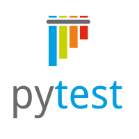
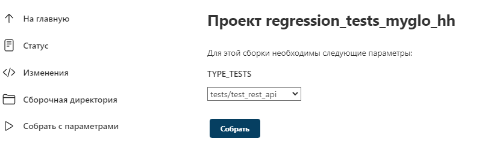
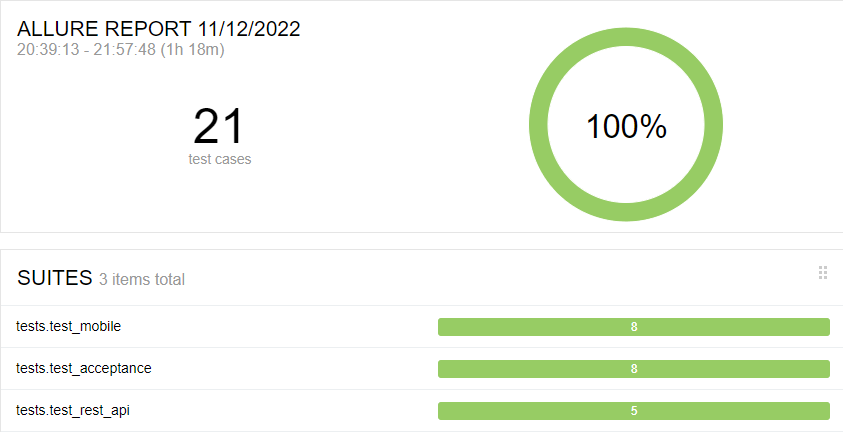
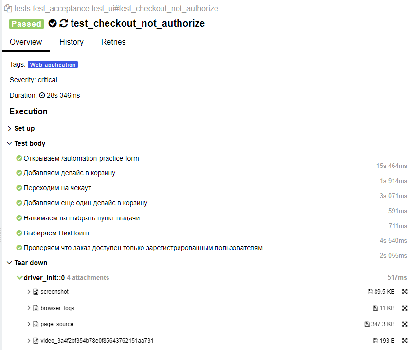
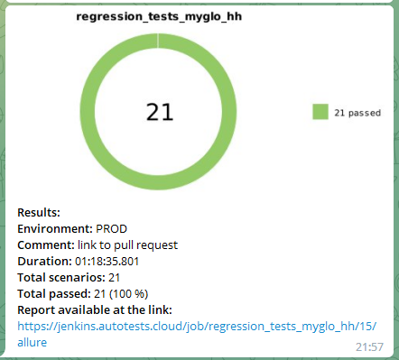
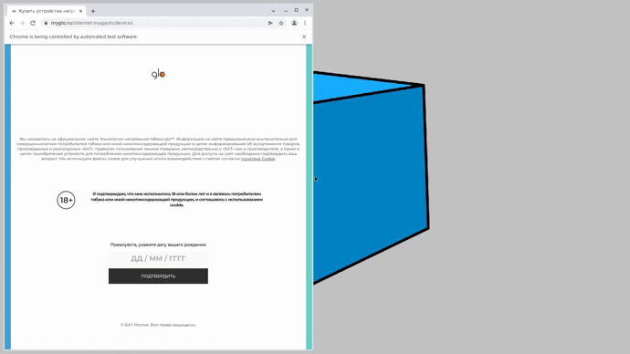

# Проект по автоматизации тестирования сайта myglo.ru и мобильного приложения hh.ru
<div style="display: flex">
    
    
</div>


## :page_with_curl:	Содержание

> :heavy_check_mark: [Технологии и инструменты](#technologist-технологии-и-инструменты)
>
> :heavy_check_mark: [Реализованы проверки](#bookmark_tabs-реализованы-проверки)
>
> :heavy_check_mark: [Запуск тестов из терминала](#computer-Запуск-тестов-из-терминала)
>
> :heavy_check_mark: [Запуск тестов в Jenkins](#-запуск-тестов-в-jenkins)
>
> :heavy_check_mark: [Отчет о результатах тестирования в Allure Report](#-отчет-о-результатах-тестирования-в-allure-report)
>
> :heavy_check_mark: [Уведомления в Telegram с использованием бота](#-уведомления-в-telegram-с-использованием-бота)
>
> :heavy_check_mark: [Пример запуска теста в Selenoid](#-пример-запуска-теста-в-selenoid)

## :technologist: Технологии и инструменты

<p  align="center">
Pytest, Python, Selene \ Selenium, PyCharm, Requests, Appium, Jenkins, Selenoid, Allure, Jira, Github, Telegram
<br/>



</p>

> *В данном проекте автотесты написаны на <code><strong>*Python*</strong></code> с использованием <code><strong>*Selenide*</strong></code> для UI-тестов и <code><strong>*Requests*</strong></code> для Api-тестов.*
>
>*Запуск тестов выполняется из <code><strong>*Jenkins*</strong></code>.*
>
>*<code><strong>*Selenoid*</strong></code> используется для запуска браузеров в контейнерах  <code><strong>*Docker*</strong></code>.*
>
>*<code><strong>*Allure Report, Jira, Telegram Bot*</strong></code> используются для визуализации результатов тестирования.*
>
>*Для запуска мобильных тестов используется <code><strong>*Appium*</strong></code> и <code><strong>*Android studio*</strong></code>.*


## :bookmark_tabs: Реализованы проверки

### &nbsp;&nbsp;&nbsp;&nbsp;&nbsp;&nbsp; API

>- [x] *Проверка Добавления девайся в корзину*
>- [x] *Проверка личных данных пользователя*
>- [x] *Проверка регистрации устройства в профиле пользователя*
>- [x] *Проверка удаления девайса из корзины, после его добавления*
>- [x] *Проверка на добавление девайса в мои девайсы*

### &nbsp;&nbsp;&nbsp;&nbsp;&nbsp;&nbsp; Web

>- [x] *Проверка требования авторизации после выбора Pick point*
>- [x] *Проверка на наличие и корректность посткода после ввода адреса*
>- [x] *Проверка работоспособности настроек в подписке*
>- [x] *Проверка кнопки оформить заказ стала активной после прохождения шагов на чекауте*
>- [x] *Негативная проверка с разными данными полей заполнения формы обратной связи*

### &nbsp;&nbsp;&nbsp;&nbsp;&nbsp;&nbsp; Mobile

>- [x] *Проверка сохранения ввода Email, после смены типа логина*
>- [x] *Проверка открытия категорий приложения*
>- [x] *Проверка блока уведомлений*
>- [x] *Проверка страницы фильтров*
>- [x] *Проверка смены языка*


## :computer: Запуск тестов из терминала
### Запуск тестов

```bash
python -m venv .venv
source .venv/bin/activate
pip install -r requirements.txt
python -m pytest tests/test_api
```

### Параметры сборки

>
> <code>tests/test_acceptance</code> – UI - тесты myglo.ru.
>
> <code>tests/test_rest_api</code> – API тесты myglo.ru.
>
> <code>tests/test_mobile</code> – Мобильные тесты hh.ru.

##  Запуск тестов в Jenkins

*Для запуска сборки необходимо указать значения параметров и нажать кнопку <code><strong>*Собрать*</strong></code>.*

<p align="center">
  
</p>

##  Отчет о результатах тестирования в Allure Report

### :pushpin: Общая информация

*Главная страница Allure-отчета содержит следующие информационные блоки:*

> - [x] <code><strong>*ALLURE REPORT*</strong></code> - отображает дату и время прохождения теста, общее количество прогнанных кейсов, а также диаграмму с указанием процента и количества успешных, упавших и сломавшихся в процессе выполнения тестов
>- [x] <code><strong>*TREND*</strong></code> - отображает тренд прохождения тестов от сборки к сборке
>- [x] <code><strong>*SUITES*</strong></code> - отображает распределение результатов тестов по тестовым наборам
>- [x] <code><strong>*ENVIRONMENT*</strong></code> - отображает тестовое окружение, на котором запускались тесты (в данном случае информация не задана)
>- [x] <code><strong>*CATEGORIES*</strong></code> - отображает распределение неуспешно прошедших тестов по видам дефектов
>- [x] <code><strong>*FEATURES BY STORIES*</strong></code> - отображает распределение тестов по функционалу, который они проверяют
>- [x] <code><strong>*EXECUTORS*</strong></code> - отображает исполнителя текущей сборки (ссылка на сборку в Jenkins)

<p align="center">
  
</p>

### :pushpin: Детали теста
<p align="center">
  
</p>

[//]: # (##  Интеграция с [Allure TestOps]&#40;https://allure.autotests.cloud/launch/15585&#41;)

[//]: # ()
[//]: # (### :pushpin: Основной дашборд)

[//]: # ()
[//]: # (<p align="center">)

[//]: # (  )

[//]: # (</p>)

[//]: # ()
[//]: # (### :pushpin: Тест-кейсы)

[//]: # ()
[//]: # (<p align="center">)

[//]: # (  )

[//]: # (</p>)

[//]: # ()
[//]: # (##  Интеграция с [Jira]&#40;https://jira.autotests.cloud/browse/AUTO-1349&#41;)

[//]: # ()
[//]: # (<p align="center">)

[//]: # (  )

[//]: # (</p>)

[//]: # ()

##  Уведомления в Telegram с использованием бота

> После завершения сборки специальный бот, созданный в <code>Telegram</code>, автоматически обрабатывает и отправляет сообщение с отчетом о прогоне тестов.

<p align="center">

</p>

##  Пример запуска теста в Selenoid


> К каждому тесту в отчете прилагается видео.

<p align="center">

  

</p>

